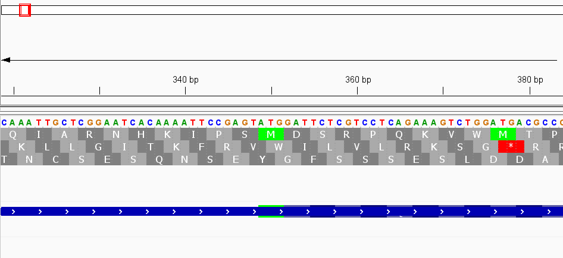

# Week 4 Assignment:  Obtain genomic data via accession numbers 
#### Aaliya Ahamed • BMMB852 • 2025-09-18

## 1) Paper Selection
Publication chosen (Group 1-Ebola):

Gire, S. K., Goba, A., Andersen, K. G., Sealfon, R. S. G., et al. (2014).  
*Genomic surveillance elucidates Ebola virus origin and transmission during the 2014 outbreak.*  
Science, 345(6202), 1369–1372. https://doi.org/10.1126/science.1259657

_This paper investigates the 2014 West African Ebola outbreak.  
It generated and analyzed 99 complete Ebola virus genomes from 78 patients.  
The study provides key accession numbers that we can use to reproduce and visualize the genomic data_


## 2)Identifing the accession numbers for the genome 

We use these accession numbers because they serve as unique, permanent identifiers in NCBI. Anyone can rerun the commands below with the same IDs to reproduce the results.
After reviewing the paper (*Gire et al., 2014*), exploring supplementary materials, and searching the NCBI database, we identified the following accession numbers:

- **SRA BioProject (2014 outbreak umbrella):** PRJNA257197  
- **Reference genome (Zaire, Mayinga 1976):** AF086833  
- **2014 Makona isolate genome (Sierra Leone outbreak):** KM233118  

## 3) Write the commands to download the data (To make the commands reusable and reproducible)

Initially, we attempted to use `efetch`, but no files were retrieved (empty files). Therefore, we downloaded manually from NCBI:

1. **Genome sequence (FASTA):**  
   - From NCBI Nucleotide [KM233118](https://www.ncbi.nlm.nih.gov/nuccore/KM233118)  
   
 We created a working directory:
```bash
mkdir -p /mnt/d/BMMB852_F2025/A4/EbolaGenomes
mv sequence.fasta ebola.fasta
mv sequence.gb    ebola.gb
```
Now, the folder has ebola.fasta and ebola.gb

## 4) Genome Size

We calculated the genome length using FASTA:
``` bash
grep -v ">" ebola.fasta | wc -m
```
Result: ~18,880 bp (≈ 19 kb), which matches published Ebola virus genome sizes.

## 5) Genomic Features

To count genes and CDS (coding sequences):
``` bash
grep -i " CDS " ebola.gb | wc -l      # number of coding sequences
grep '/gene="' ebola.gb | wc -l       # number of genes

```
Result:

Coding sequences (CDS): 9

Genes: 9 (including overlaps/duplicates due to transcription editing)

Gene names extracted:
``` bash
grep '/gene="' ebola.gb
```

Result:
NP, VP35, VP40, GP, VP30, VP24, L (with duplicates due to alternate transcripts).

## 6) Longest Gene

We identified the longest CDS:
``` bash
grep -E " CDS " ebola.gb
grep -A 5 "11460..18098" ebola.gb
```

Result:

Coordinates: 11460..18098

Gene: L

Length: ~6,639 bp

Function: RNA-dependent RNA polymerase (viral replication and transcription)
## 7) What are the other genes like?

The Ebola Makona genome encodes **seven major genes**. Coordinates were extracted from the downloaded GenBank file (`ebola.gb`, accession KM233118). Functional descriptions are based on annotations in NCBI GenBank. 

1. **NP (Nucleoprotein)**  
   - Coordinates: ~349–2568  
   - Length: ~2,220 bp  
   - Function: Encapsidates viral RNA to form the nucleocapsid and is essential for replication and transcription.
   - Biological importance: NP provides the structural scaffold for the ribonucleoprotein complex, without which the polymerase cannot initiate replication. It is one of the first proteins expressed during infection, setting the stage for viral replication.
2. **VP35 (Viral Protein 35)**  
   - Coordinates: ~3008–4030  
   - Length: ~1,023 bp  
   - Function: Cofactor for the polymerase (L protein) and a strong interferon antagonist, helping the virus evade the host immune response.
   - Biological importance: VP35’s immune evasion role is critical for Ebola pathogenesis. It blocks RIG-I–like receptor signaling and interferon production, allowing the virus to replicate undetected in the early stages of infection.

3. **VP40 (Viral Protein 40)**  
   - Coordinates: ~4358–5338  
   - Length: ~981 bp  
   - Function: Major matrix protein, drives virus particle assembly and budding from the host cell membrane.
   - Biological importance: VP40 is the main determinant of virion morphology. Remarkably, VP40 alone can induce the formation of virus-like particles, making it a central target for studying Ebola’s structure and transmission. Its efficient budding function is directly linked to viral spread.

4. **GP (Glycoprotein)**  
   - Coordinates: ~5918–7012 (with RNA editing variants)  
   - Length: ~1,095 bp (basic form; longer if edited)  
   - Function: Surface glycoprotein mediating viral entry by binding to host receptors and enabling membrane fusion. Alternative editing creates sGP (soluble form) and full-length GP.
   - Biological importance: GP is the only surface-exposed protein and the primary target of neutralizing antibodies. It is the antigen used in Ebola vaccines (e.g., rVSV-ZEBOV). Mutations in GP can affect immune recognition and transmissibility, making it a critical focus for therapeutic and vaccine research.

5. **VP30 (Viral Protein 30)**  
   - Coordinates: ~8388–9254  
   - Length: ~867 bp  
   - Function: Transcription factor that initiates viral mRNA synthesis by activating the polymerase complex.
   - Biological importance: VP30 acts as a transcriptional switch. Without it, the polymerase fails to produce sufficient mRNA, stalling infection. It ensures proper expression of downstream genes, making it essential for efficient replication cycles.

6. **VP24 (Viral Protein 24)**  
   - Coordinates: ~10224–10979  
   - Length: ~756 bp  
   - Function: Minor matrix protein; interferes with host interferon signaling pathways, contributing to immune evasion.
   - Biological importance: VP24 disrupts the JAK-STAT signaling pathway by blocking STAT1 nuclear import, effectively shutting down the host antiviral response. This immune evasion role is a major contributor to Ebola’s high lethality.

7. **L (RNA-dependent RNA Polymerase)**  
   - Coordinates: ~11460–18098  
   - Length: ~6,639 bp (longest gene)  
   - Function: Catalyzes replication and transcription of the viral RNA genome; essential enzyme for viral propagation.
   - Biological importance: The L gene encodes the central enzyme of the replication complex. Because of its size and multifunctional role, it is a potential drug target, as inhibitors of RdRp could theoretically halt viral propagation (https://pubmed.ncbi.nlm.nih.gov/10073695/)


   
   **Figure 1.** Ebolavirus genome and protein layout.  
The schematic shows the order of genes (3'-leader → NP → VP35 → VP40 → GP → VP30 → VP24 → L → 5'-trailer) and highlights the proteins they encode.

   _(Baseler, Laura & Chertow, Daniel & Johnson, Karl & Feldmann, Heinz & Morens, David. (2016). The Pathogenesis of Ebola Virus Disease. Annual review of pathology. 12. 10.1146/annurev-pathol-052016-100506)_. 


## 8) IGV
### Note on Annotation File

During the workflow, the initial attempt to download the annotation file (`ebola.gb`) using **efetch** produced a 0 KB empty file. This happened because not all viral genomes in NCBI provide GFF or GenBank annotations through efetch. To resolve this, I manually downloaded the annotation file from the NCBI Nucleotide entry for **KM233118**.  The corrected file (`ebola.gb`) contained full feature annotations (genes, CDS, products). This file, together with the genome sequence (`ebola.fasta`), was then successfully loaded into IGV for visualization.

Fig 2: 
The above image shows: The NP gene is located near the 5′ end of the genome (coordinates ~349–2568 bp). It encodes the nucleoprotein, which encapsidates the viral RNA genome, forming the nucleocapsid. This protein is essential for viral replication and transcription because it stabilizes and protects the RNA, and provides the framework for polymerase activity.  The IGV snapshot confirms that NP is a compact coding region with no introns, reflecting the dense, efficient organization of the Ebola virus genome.

Fig 3: 
This visualization directly demonstrates that Ebola virus has a densely packed genome. Genes like NP and VP35 are separated by only a few nucleotides (sometimes overlapping regulatory regions), showing that nearly all of the ~19 kb genome is coding. This explains the efficiency of Ebola’s genome in encoding multiple essential proteins within a small sequence.
The NP and VP35 genes are among the first transcribed in the Ebola virus genome and illustrate the compactness of viral organization. The NP gene encodes the nucleoprotein, which encapsidates the viral RNA genome, protecting it from degradation and forming the ribonucleoprotein complex essential for replication. Immediately downstream, the VP35 gene encodes a multifunctional protein that acts as both a polymerase cofactor and a potent antagonist of the host interferon response. In the Ebola genome, NP and VP35 are separated by only a few nucleotides, and in some strains their regulatory signals even overlap. This tight arrangement highlights how the virus maximizes coding capacity within a relatively small genome of ~19 kb, minimizing non-coding space. Such proximity also has implications for transcriptional regulation, as transcriptional start/stop signals are shared or closely packed, potentially influencing gene expression levels. Previous studies have shown that VP35’s interferon-antagonist function is critical for viral pathogenicity, while NP provides the structural foundation for viral replication complexes (Basler et al., 2003; Mühlberger, 2007).

Fig 4: 

This image shows the precise region (~2910–2960 bp) where NP terminates and VP35 begins. The absence of intergenic space, with transcriptional stop and start signals immediately adjacent, demonstrates the genome’s extreme compactness. Such tight packing maximizes coding efficiency within the 19 kb genome, while also suggesting that mutations in these boundary regions could influence both genes simultaneously

Fig 5: 

The screenshot above shows the L gene, which encodes the RNA-dependent RNA polymerase, the key enzyme responsible for transcription and replication of the Ebola virus genome. This gene occupies almost the entire 3′ end of the genome, reflecting its large size relative to the other viral genes. The visualization confirms that the Ebola genome is densely packed with coding sequences, with the L gene being by far the largest.

## 9) Thought Question
For this weeks assignment, we primarily worked with KM233118 (Makona strain, Sierra Leone 2014) as the reference genome, with AF086833 (Mayinga strain, Zaire 1976) serving as a historic baseline. However, several alternative Ebola virus genome builds are available in NCBI that could be useful for answering different questions. Examples include NC_002549.1 (Mayinga, 1976, RefSeq), KJ660346.2 (Guinea, early 2014 outbreak), KR534588.1 (Liberia, 2014 mid-outbreak), and KY425633.1 (Sierra Leone, 2015 late outbreak). Using these alternative genomes allows for comparative analyses across both geography and time. For instance, comparing Guinea, Liberia, and Sierra Leone isolates helps us investigate whether distinct mutations correlate with regional transmission, while comparing early (2014) and later (2015) genomes can highlight how rapidly the virus accumulated mutations during the epidemic. Prior studies, such as Gire et al, 2014 (https://www.science.org/doi/10.1126/science.1259657), showed that two distinct lineages introduced from Guinea seeded the Sierra Leone outbreak, while later work by Hoenen et al., 2015 (https://www.science.org/doi/10.1126/science.aaa5646) emphasized that many mutations were consistent with incomplete purifying selection. By extending analyses to genes like GP (glycoprotein) and L (RNA polymerase), we can ask whether mutations had functional consequences: for example, GP changes that might influence vaccine effectiveness or L changes that could alter replication efficiency. Additionally, alternative builds help address practical issues such as whether diagnostic primers lost sensitivity due to mutations, as noted in the original Sierra Leone dataset. In summary, working with multiple genome builds not only expands our view of Ebola’s evolutionary dynamics but also connects sequence-level changes to critical public health questions such as diagnostics, therapeutics, and epidemic spread.