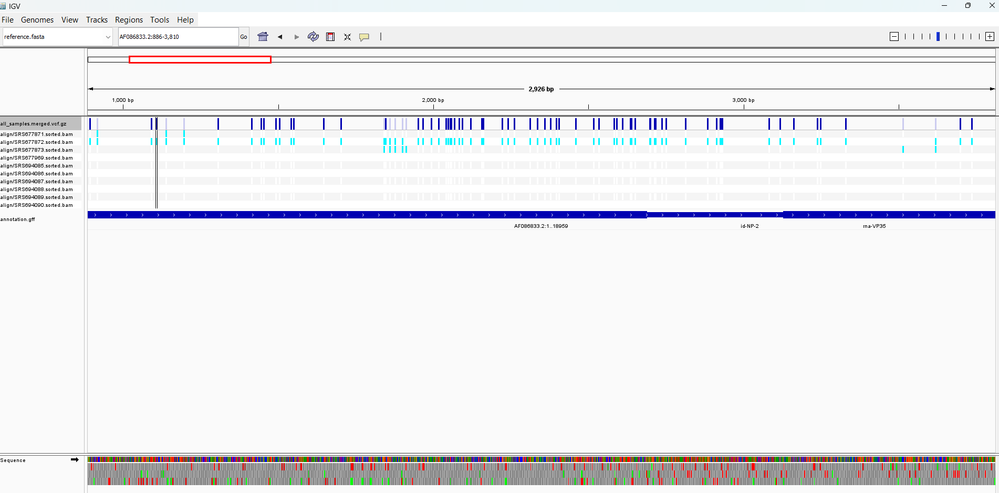
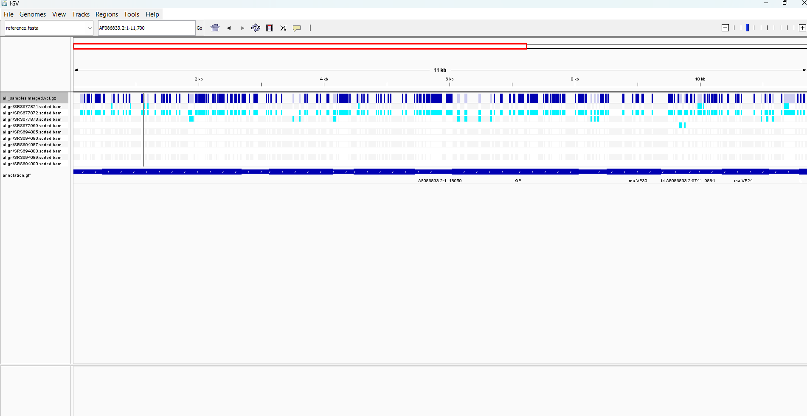

# Week 10 Assignment: Generate a multisample variant call file (VCF)
### Aaliya Ahamed • BMMB852 • 2025-11-02


This Makefile provides two main ways to run the pipeline.

1. Run a Single Sample

``` bash
make call SRR=SRR1564803 SAMPLE=SRS694085
```

This creates the aligned align/SRS694085.sorted.bam file and the final results/SRS694085.vcf.gz file.

2. Run All Samples (Recommended)
``` bash
make call_all
```

This single command runs the entire pipeline for all samples and produces:

An individual BAM and VCF for each sample.

The final merged file: results/all_samples.merged.vcf.gz.

Final Visualization

The final step is to visualize the VCF file data alongside the BAM files and the GFF annotation. The files were loaded into the Integrative Genomics Viewer (IGV).


Pipeline has discovered that samples SRS677871 and SRS677872 are very different from the other 8 samples. They have a unique set of mutations (all the light blue ticks) that the others don't have.

The other 8 samples (like SRS694085, SRS694086, etc.) are much more similar to the reference genome. They have very few mutations.