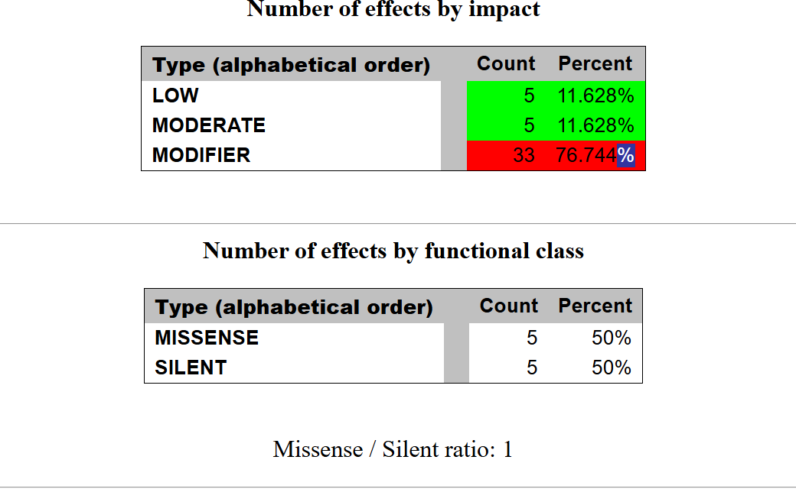
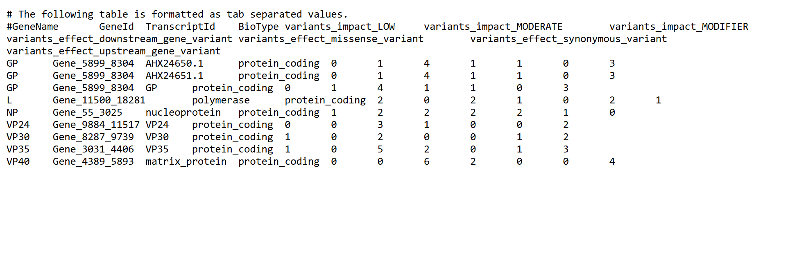
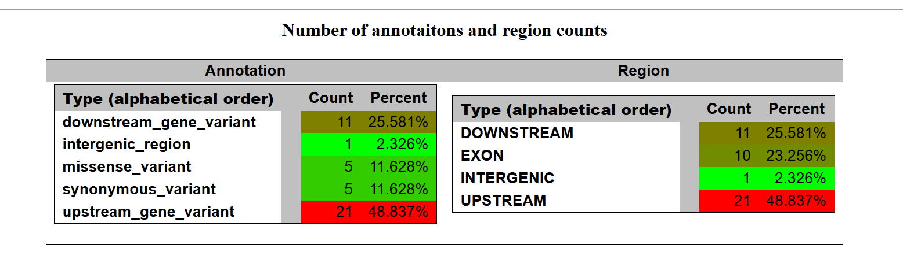

# Assignment 11: Variant Effect Prediction

**Name:** Aaliya\
**Date:** 2025-11-07

---

This Makefile pipeline is an extension of the previous assignment. 

## Command Usage

Here are the main commands to run the pipeline from the terminal.

Run the Entire Pipeline (All Samples)

This is the main command. It cleans old files and then runs the complete pipeline, including the snpEff annotation.
```bash
# First, clean up any old or partial results
make clean

# Run the full pipeline from start to finish
make call_all
```

Run for a Single Sample
```bash
#To process only one sample, we can use the call target by providing an SRR and SAMPLE name.
make call SRR=SRR123456 SAMPLE=MyTestSample
```
## Tools to Install

My pipeline requires these tools to be installed on your system:

bwa

samtools

bcftools

htslib-tools (for bgzip and tabix)

wget (for downloading files)

java (for snpEff)

SnpEff Setup (One-Time)

I used snpEff for variant annotation.

Install SnpEff:

```bash
conda install -c bioconda snpeff
```

Download the Database: 
```bash
# First, I found the database name
# java -jar snpEff/snpEff.jar databases | grep -i "ebola"

# Then, I downloaded the 'ebola_zaire' database
java -jar snpEff/snpEff.jar download -v ebola_zaire -c snpEff/snpEff.config
```

Required Input Files

```bash
SRR,SampleName
SRR1564803,SRS694085
SRR1564804,SRS694086
```

## How I Analyzed My Results

To finish the assignment, I used the files my pipeline created.

I opened my results/snpEff_report.html file to see the summary charts (like 5 MODERATE, 5 LOW impact).

I discovered my HTML links were broken and the full data was in the text VCF. I used this command to pull the variant data I needed:
```bash
cat results/all_samples.ann.vcf | grep -E "missense_variant|synonymous_variant"
```
I used that text output to find 3 variants for my report and analyze their effects.


## Workflow
1.  **Pipeline Setup:** I used a `Makefile` to automate the entire process. This pipeline first ensures all reference files (FASTA) and tools (`bwa`, `samtools`, `bcftools`, `htslib-tools`) are in place.
2.  **Sample Processing:** The `call_all` target looped through my `design.csv` file, processing 10 samples. For each sample, it downloaded 10,000 reads from the SRA using `fastq-dump`.
3.  **Alignment & Variant Calling:** Each sample's reads were aligned to the Ebola reference genome (`KJ660346.2`) using `bwa mem`. The resulting alignments were sorted (`samtools sort`) and indexed. Variants were called using `bcftools mpileup` and `bcftools call`.
4.  **Merging:** All 10 single-sample VCF files were merged into one master file: `all_samples.merged.vcf.gz`.
5.  **Annotation with snpEff:** This is where the new steps occurred.
    * To make `snpEff` work, I had to create a special copy of the VCF. The `snpEff` database (`ebola_zaire`) expected the chromosome to be named `KJ660346.1`, but my VCF used `KJ660346.2`.
    * The `Makefile` automatically created a "map file" (`chrom_map.txt`) to handle this.
    * It then used `bcftools annotate --rename-chrs` to create a new, properly-named VCF: `all_samples.for_snpeff.vcf.gz`.
    * Finally, it ran `snpEff` on this new file, which successfully generated the `snpEff_report.html` (for summary stats) and the final annotated VCF, `all_samples.ann.vcf`.
6.  **Analysis:** I analyzed the output from `snpEff` to find variants of different impacts.

## Variant Analysis Results

The `snpEff` analysis of the 9 variants found in the merged VCF file revealed a total of 43 functional annotations. These were categorized by impact (based on my `snpEff_report.html`):

* **MODERATE:** 5 variants (11.6%)
* **LOW:** 5 variants (11.6%)
* **MODIFIER:** 33 variants (76.7%)

The 10 coding annotations were evenly split between 5 **missense** (Moderate) and 5 **synonymous** (Low) variants. I selected three of these from my `all_samples.ann.vcf` file for my final analysis.

---

### Variant 1: MODERATE Impact (Missense)

* **Gene:** `NP` (nucleoprotein)
* **Position:** 800
* **Change:** `C > T`
* **Effect:** `p.Arg111Cys` (Arginine to Cysteine)
* **Analysis:** This is a **missense variant**, which means the nucleotide change resulted in a *different* amino acid being coded. An Arginine (a basic, positively charged amino acid) was replaced by a Cysteine (a polar, uncharged amino acid). This change in chemical properties could potentially affect the protein's folding or function.

### Variant 2: LOW Impact (Synonymous)

* **Gene:** `NP` (nucleoprotein)
* **Position:** 1849
* **Change:** `T > C`
* **Effect:** `p.Asp460Asp` (Aspartic acid to Aspartic acid)
* **Analysis:** This is a **synonymous variant** (also called a "silent" mutation). Although the nucleotide changed from T to C, the resulting codon still codes for the same amino acid (Aspartic acid). This mutation has a "LOW" impact because it does not change the final protein sequence.

### Variant 3: MODERATE Impact (Different Gene)

* **Gene:** `GP` (glycoprotein)
* **Position:** 6283
* **Change:** `C > T`
* **Effect:** `p.Ala82Val` (Alanine to Valine)
* **Analysis:** This is another **missense variant**. It changes an Alanine to a Valine. Both are nonpolar, hydrophobic amino acids, but Valine is slightly larger. This change is less drastic than the first example but still modifies the protein sequence and is therefore considered a "MODERATE" impact.


Understanding My Final Outputs:




