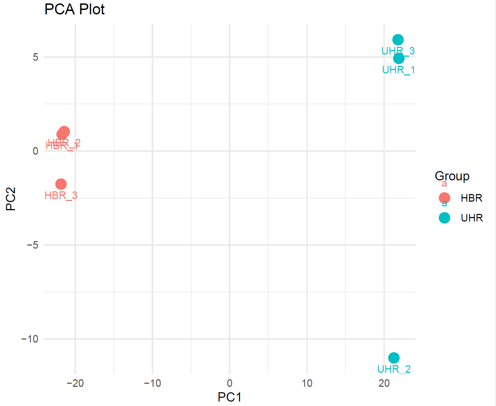
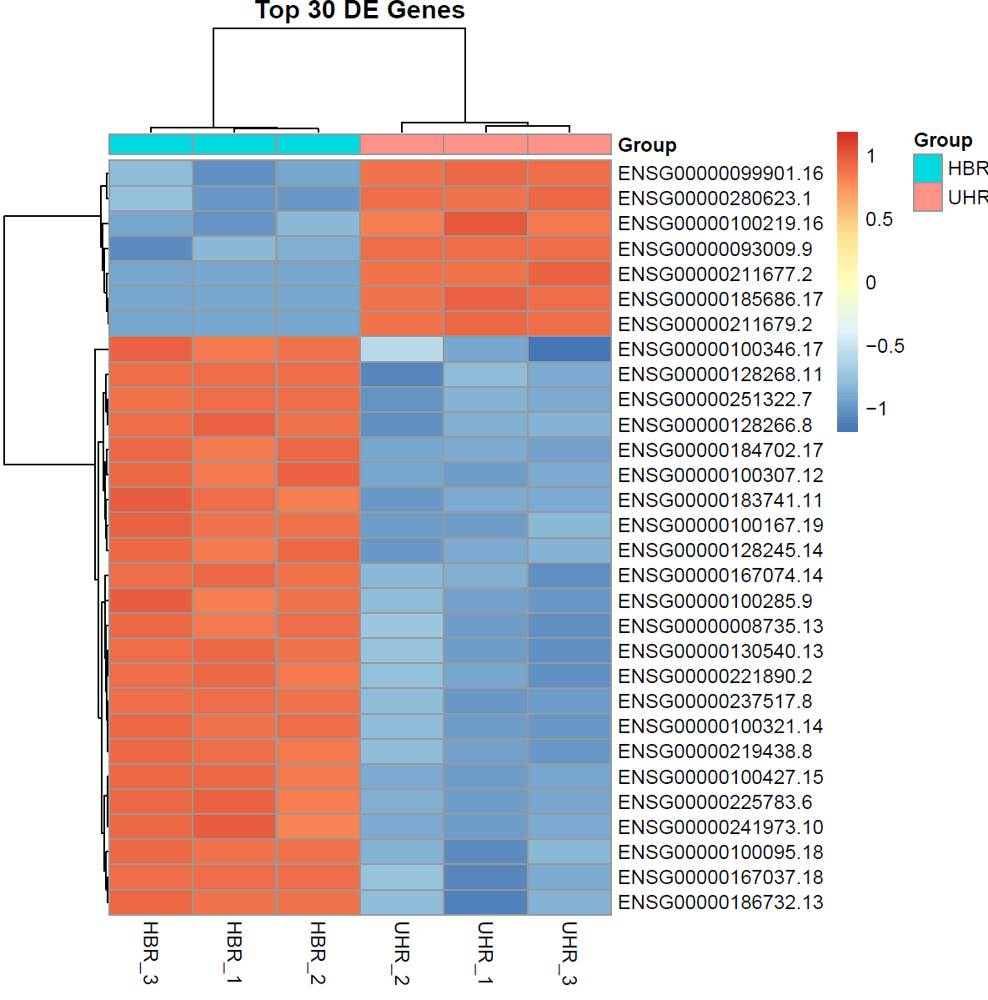

## Week 14 Assignment: RNA-Seq Differential Expression Analysis: HBR vs. UHR
## Aaliya • BMMB852 • 2025-12-013


## Perform a differential expression analysis on an RNA-Seq count matrix.
This assignment extends the RNA-seq analysis workflow from read quantification to biological interpretation. The pipeline now includes:

Loading the gene count matrix generated in the previous step

Performing statistical analysis to identify differentially expressed genes (DEGs)

Visualizing sample clustering and gene expression patterns

Conducting functional enrichment analysis on the significant genes

## Input Data and Experimental Design
The analysis begins with the counts.txt file generated by featureCounts in the previous assignment. To define the experimental structure, a design.csv file was created to assign the six samples to their respective groups: Human Brain Reference (HBR) and Universal Human Reference (UHR).

```bash
Sample,Group
HBR_1,HBR
HBR_2,HBR
HBR_3,HBR
UHR_1,UHR
UHR_2,UHR
UHR_3,UHR
```
The entire analysis is automated using a Makefile which triggers a unified R script 
```bash 
make all
```

## Differential Expression Analysis
Differential expression was performed using edgeR, which models the RNA-Seq count data using a negative binomial distribution. The analysis pipeline performs the following steps:

Normalization: Applies Trimmed Mean of M-values (TMM) to account for sequencing depth differences.

Dispersion Estimation: Estimates biological variability between replicates.

Statistical Testing: Uses an exact test to identify genes that are significantly different between the Brain (HBR) and Universal (UHR) samples.


## Generate PCA and Heatmap visualizations
The pipeline generates quality control visualizations to verify the biological signal in the data.

Principal Component Analysis (PCA) The PCA plot shows a dramatic separation between the two groups. PC1 explains the vast majority of the variance, confirming that the tissue type (Brain vs. Universal) is the primary driver of differences in the dataset.


Hierarchical Clustering Heatmap A heatmap of the top 30 differentially expressed genes confirms the consistency of the replicates. The samples cluster perfectly by group, with distinct blocks of genes upregulated in HBR versus UHR.


## Identify a set of differentially expressed genes
The analysis successfully identified a robust set of differentially expressed genes. Using a False Discovery Rate (FDR) cutoff of < 0.05, the pipeline filtered the results to isolate the most significant genes.

Sample of the top results 
```bash
GeneID,logFC,logCPM,PValue,FDR
ENSG00000100095.18, 11.54, 12.05, 8.35e-218, 1.14e-215
ENSG00000100321.14, -5.17, 11.81, 3.46e-211, 4.31e-209
...
```

## Perform functional enrichment analysis
Functional enrichment was attempted using the g:Profiler toolset (via the gprofiler2 package) to map the significant genes to biological pathways.

For this specific subset of data (Chromosome 22), the analysis found that while individual genes were differentially expressed, they did not form statistically significant enriched Gene Ontology (GO) terms after multiple testing correction. This is a valid biological result for a chromosomal subset, indicating that the significant genes on Chr22 are likely involved in diverse, rather than singular, biological processes.

## Reproducibility
The entire workflow from raw counts to final figures is reproducible with a single command:

```bash
make clean
make all
```