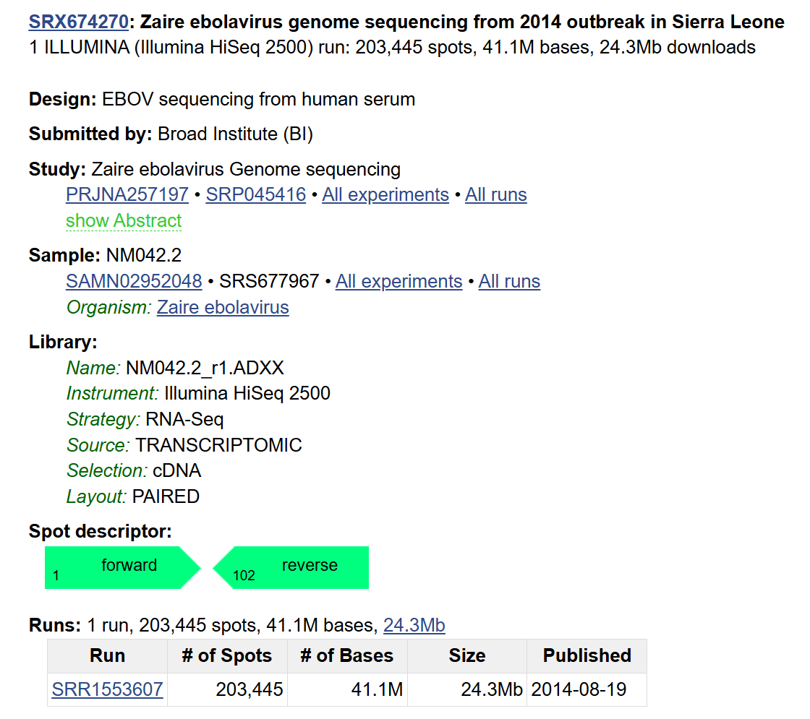
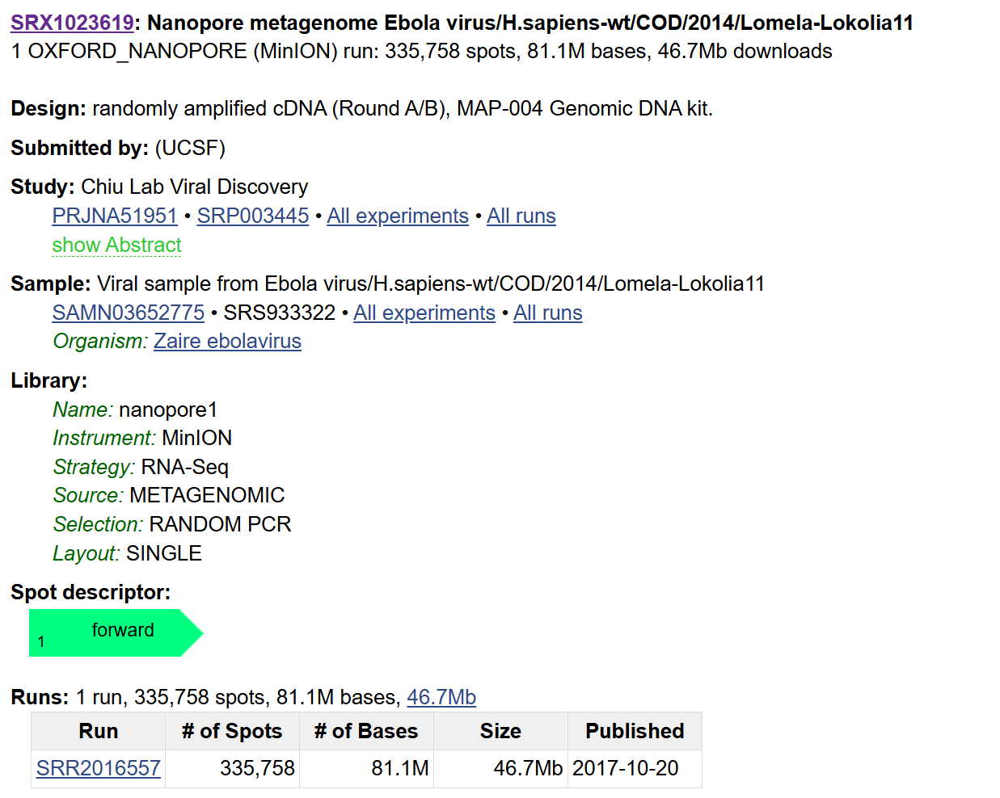
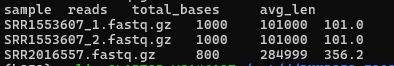
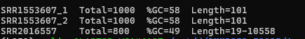

# Week 5 Assignment: Obtain and visualize FASTQ data from SRA
#### Aaliya Ahamed • BMMB852 • 2025-09-25
**Paper:** Gire et al., 2014, *Science:  “Genomic surveillance elucidates Ebola virus origin and transmission during the 2014 outbreak.”  
**Focus genome:** Ebola virus (Makona lineage, ~19 kb)
## 1) Public accessions used

- **BioProject :** `PRJNA257197`
- **Example Illumina run:** `SRR1553607` (Makona, 2014)
- **Different platform (comparison):** Oxford Nanopore MinION example `SRR2016557` (Zaire ebolavirus)





## 2) Calculating Coverage
Coverage ≈ (total bases downloaded) ÷ (genome size).

Target bases for 10×: 19,000 × 10 = 190,000 bases

Illumina 2×100 bp ≈ ~200 bases/spot → 190,000/200 ≈ 950 spots → I used 1,000 spots.

ONT average read length in my subset ≈ 356 bp → 190,000/356 ≈ ~534 reads → I used 800 reads (≥10×; can trim to ~540 for ~10× exactly).

## 3) Project Environment Setup
``` bash
export MAMBA_ROOT_PREFIX=~/micromamba
eval "$(micromamba shell hook -s bash)"
micromamba activate b852
cd /mnt/d/BMMB852_F2025/Assignment5
bash week5/run.sh
```

## 4) Script 
``` bash
#!/usr/bin/env bash
set -euo pipefail

#  IDs from the paper
BIOPROJECT="PRJNA257197"
SRR_ILLUMINA="SRR1553607"    # Illumina HiSeq 2500, paired-end
SRR_ONT="SRR2016557"         # Oxford Nanopore MinION, single-end

#  ~10× settings 
GENOME_BP=19000
ILLUM_SPOTS=1000             # ~200 bp/spot => ~10×
ONT_READS=800                # ~356 bp/read in my subset => >=10×

#  Paths 
BASE="/mnt/d/BMMB852_F2025/Assignment5/week5"
RAW="$BASE/raw"; QC="$BASE/qc"; LOG="$BASE/logs"
mkdir -p "$RAW" "$QC" "$LOG"

#  Download & Prepare Data
echo "[i] Downloading subsets..."

# Illumina (paired)
if [ ! -f "$RAW/${SRR_ILLUMINA}_1.fastq.gz" ]; then
  fastq-dump --split-files -X "$ILLUM_SPOTS" -O "$RAW" "$SRR_ILLUMINA"
  pigz -p 4 "$RAW/${SRR_ILLUMINA}_1.fastq" "$RAW/${SRR_ILLUMINA}_2.fastq"
fi

# ONT (single): try SRA; fallback to ENA if needed, then subset to N reads
if [ ! -f "$RAW/${SRR_ONT}.fastq.gz" ]; then
  if fastq-dump -X "$ONT_READS" --minReadLen 1 -O "$RAW" "$SRR_ONT"; then
    pigz -p 4 "$RAW/${SRR_ONT}.fastq"
  else
    echo "[!] SRA hiccup -> using ENA mirror"
    URL="https://ftp.sra.ebi.ac.uk/vol1/fastq/SRR201/007/SRR2016557/SRR2016557.fastq.gz"
    curl -L --fail --retry 5 --retry-delay 3 -o "$RAW/${SRR_ONT}.fastq.gz" "$URL"
    zcat "$RAW/${SRR_ONT}.fastq.gz" | awk -v N="$ONT_READS" 'NR<=4*N' | gzip > "$RAW/${SRR_ONT}.tmp.gz"
    mv "$RAW/${SRR_ONT}.tmp.gz" "$RAW/${SRR_ONT}.fastq.gz"
  fi
fi

echo "[i] Computing basic read stats..."
ST="$LOG/read_stats.tsv"
echo -e "sample\treads\ttotal_bases\tavg_len" > "$ST"
for f in "$RAW"/*.fastq.gz; do
  seqkit stats -Ta "$f" | awk -v F="$(basename "$f")" 'NR==2{print F"\t"$4"\t"$5"\t"$7}'
done >> "$ST"
column -t "$ST"

echo "[i] Running FastQC..."
fastqc -o "$QC" -t 4 "$RAW"/*.fastq.gz

echo -e "\n[✓] Done."
echo "FASTQs:   $RAW"
echo "Stats:    $ST"
echo "FastQC:   $QC/*_fastqc.html"
``` 
## 5)Results
->Basic Statitics
``` bash
column -t /mnt/d/BMMB852_F2025/Assignment5/week5/logs/read_stats.tsv
```



_Why this matches expectations: 1,000 Illumina spots ≈ 200k bases (2×100 bp) ⇒ ~10×.
ONT subset (800 × ~356 bp) ≈ 285k bases ⇒ ~15×_

->FastQC  metrics



_Illumina reads are fixed-length (101 bp) with GC≈58% and high per-base quality. ONT shows variable read lengths (tens of bp up to ~10.5 kb in your subset) and lower GC (≈49%), which is typical for ONT and for small subsets_.


Illumina (SRR1553607 R1/R2)

PASS: Basic Statistics, Per base sequence quality, Per sequence quality scores, Sequence length distribution, Duplication levels, Adapter content

FAIL: Per base sequence content, Per sequence GC content

WARN: Overrepresented sequences
Interpretation: Fixed 101 bp reads with high per-base Q (Q30+). FAIL/WARN flags are common on tiny subsets (1,000 spots) because composition/duplication is skewed.

ONT (SRR2016557)

PASS: Basic Statistics, Per base sequence quality, Per sequence quality scores, Per base N content, Duplication levels, Adapter content

WARN: Per base sequence content, Sequence length distribution (variable lengths: ~19–10,5 kb in this subset)

Key metrics: Total=800 reads, %GC≈49, variable length (avg ~356 bp here after subsetting)
Interpretation: ONT shows broader length distribution and lower per-base Q than Illumina—expected for MinION reads and small subsets.

## 6) Platform comparison 

Illumina (HiSeq 2500): short, highly accurate reads; best for single-nucleotide variants and high-confidence consensus. Uniform 101 bp length; high Q.

Oxford Nanopore (MinION): long/variable reads; useful for spanning repeats/structural regions and rapid/field sequencing. Per-base error is higher, and base composition/length modules often WARN, but the long context is valuable.

In our subsets: Illumina delivered ~10.6× with tight 101 bp reads; ONT delivered ~15× with longer, more variable reads.