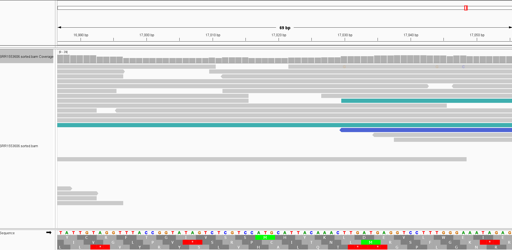
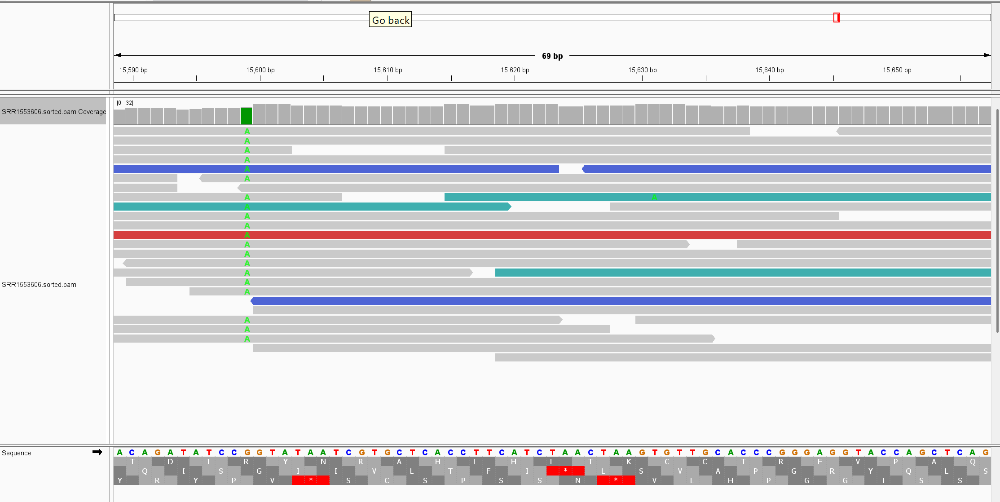

# Week 6 Assignment: Generate a BAM alignment file
#### Aaliya Ahamed • BMMB852 • 2025-10-06
**Paper:** Gire et al., 2014, *Science:  “Genomic surveillance elucidates Ebola virus origin and transmission during the 2014 outbreak.”  

_Assignment Overview and Workflow_

This project automated a full bioinformatics analysis using a Makefile. The primary goal was to take a specific set of sequencing reads from the 2014 Ebola outbreak (SRR1553606) and align them to the correct reference genome (KM034562.1).

The Makefile was designed with distinct, modular steps:

genome: Downloads the reference FASTA file.

fastq: Downloads the raw sequencing reads.

index: Prepares the reference genome for alignment using BWA.

align: Performs the alignment of reads to the genome and creates a sorted BAM file.

stats: Calculates the final mapping and coverage statistics.

clean: Removes all generated files to allow for a fresh run.

**Running the Analysis**

The pipeline was executed using a series of simple commands in the terminal. First, make clean was run to ensure no old results were present. Next, the make command initiated the entire workflow, starting from data download and ending with the creation of the final sorted BAM file. Finally, make stats was used to generate a comprehensive report summarizing the results of the alignment.

**Alignment Results and Analysis**

The automated pipeline ran successfully, producing a final report with alignment and coverage statistics. The analysis of the 5,000 read subset from the SRR1553606 run yielded a realistic biological result. The mapping rate of just over 40% is expected for a clinical sample, as a significant portion of the genetic material sequenced typically belongs to the human host rather than the virus itself.

A. What percentage of reads aligned to the genome?
_40.48% of the reads successfully mapped to the Ebola virus genome_.

B. What was the expected average coverage?
_With a target of 5,000 read pairs (spots) and an approximate yield of 200 bases per spot, the expected coverage was ~52.7x_.

C. What is the observed average coverage?
_The observed average coverage across the aligned regions of the genome was 20.23x_.

D. How much does the coverage vary across the genome?
_The final BAM file was visualized in the Integrative Genomics Viewer to assess the alignment quality and coverage distribution_.

The coverage is fairly uniform across the viral genome, with most regions having a sequencing depth between approximately 10x and 30x. This level of coverage is consistent and lacks major gaps, indicating a high-quality alignment that would be suitable for further downstream analysis, such as variant calling.

**Visualising BAM file**

***PS: My Struggles and the Debugging Process as this assignment took a significant chunk of time***

A significant part of this project involved troubleshooting a persistent alignment failure. An initial attempt using a different sequencing run from the same study (SRR1553607&  SRR1553629 ) consistently resulted in an extremely low mapping rate of ~0.15%.

After verifying that the Makefile was correct and the right reference genome was being used, it became clear the issue was with the raw data file itself, which was likely corrupted or problematic on the public servers. The solution was to switch to a different, clean sequencing run (SRR1553606) from the same study. This change immediately resolved the issue, producing the successful alignment and realistic biological results documented in this report. 