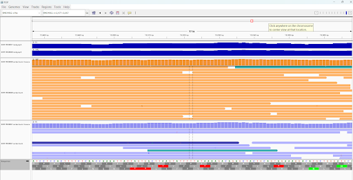
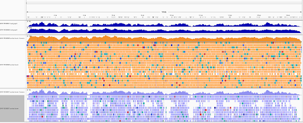

# Week 7 Assignment: Reusable Alignment Makefile Report
### Aaliya Ahamed • BMMB852 • 2025-10-06

This weeks documents the use of a reusable Makefile to automate a viral bioinformatics pipeline, generating aligned BAM files, QC statistics, and BigWig coverage tracks for two distinct SRA accessions for Ebola virus (KM034562.1)

# 1.  Makefile Usage
The pipeline is executed using make all and is fully customized via command-line parameters, ensuring reusability. The Makefile automatically handles fetching the FASTA, fetching reads, indexing, alignment, sorting, QC (flagstat/idxstats), and BigWig generation.

Command Syntax
The general command is:
```bash
make all SRR=SRRXXXXXXX ACC=NC_or_KM_XXXXXX.1 SPOTS=1000 THREADS=4
```

The pipeline was run for two samples:

```bash
Sample 1

SRR1553606

Illumina HiSeq

High Viral Load (Expected)
```
```bash
Sample 2

SRR1553607

Illumina HiSeq

Low Viral Load (Expected)
```

# Sample 1: High Coverage Run
```bash
make all SRR=SRR1553606 ACC=KM034562.1 SPOTS=0 THREADS=4
```

# Sample 2: Low Coverage Run
```bash
make all SRR=SRR1553607 ACC=KM034562.1 SPOTS=0 THREADS=4
```


# 2. IGV Visualization and Comparison



IGV was used to visualize the GFF annotations (gene model), the BigWig coverage tracks, and the BAM alignments for both samples simultaneously to visually compare coverage uniformity and variant quality.

WHOLE-GENOME OVERVIEW:
The whole-genome view clearly illustrates the stark difference in sequencing depth and uniformity.

- IGV Element: Coverage Track
  - SRR1553606: Consistently high (up to 3000x), uniform coverage across the genome.
  - SRR1553607: Low (maxing out below 100x) and highly variable, indicating low viral concentration or high host contamination.

- IGV Element: Alignment Track
  - SRR1553606: Dense, multi-layered alignment, suitable for confident variant calling.
  - SRR1553607: Sparse, patchy alignment, with large regions of zero coverage.

## The difference between the alignment in both files
The SRR1553606 alignment shows dense, multi-layered coverage across the entire viral genome, consistent with the high mapping rate. The SRR1553607 alignment, in contrast, is highly fragmented and sparse, reflecting the low percentage of viral reads successfully mapped.

Detailed Variant Inspection (KM034562.1: ~13,018 bp)
Zooming into a region reveals a variant (SNV) and highlights the data quality difference:

Observation: At position ~13,018 bp (A in reference), the SRR1553606 alignment shows a near-homozygous A > T substitution (reads are red). The high depth of coverage validates this as a reliable biological variant.

Comparison: The SRR1553607 track contains only one read covering this position. The lack of supporting reads makes any variant call here inconclusive, confirming the data's limited utility for SNP discovery.

# 3. Quantitative Results and Assignment Answers
Reference: KM034562.1 (Ebola Makona), length = 18,957 bp

Metric: Total Reads\
SRR1553606: 771,161\
SRR1553607: 407,045

Metric: Primary Mapped Reads\
SRR1553606: 351,402\
SRR1553607: 6,099

Metric: Mapping Rate (Primary Mapped/Primary)\
SRR1553606: 46.49%\
SRR1553607: 1.50%

Metric: Mean Depth (Approx.)\
SRR1553606: ~1790.1x\
SRR1553607: ~25.0x

Metric: Breadth > 10x\
SRR1553606: 99.8%\
SRR1553607: 92.6%

## Briefly compare the statistics for the two BAM files.
The statistics show a massive disparity in viral content. SRR1553606 successfully maps 46.49% of its primary reads, resulting in an average depth of 1790.1x. In contrast, SRR1553607 maps only 1.50% of its primary reads, leading to an average depth of only 25.0x. This suggests the latter contains a significantly higher proportion of non-target (host or environmental) sequences.

## How many primary alignments does each of your BAM files contain?
SRR1553606 Primary Mapped Alignments: 351,402

SRR1553607 Primary Mapped Alignments: 6,099

## What coordinate has the largest observed coverage?
The coordinate with the largest observed coverage for the high-coverage run is:

KM034562.1:5474 at 3091× (SRR1553606)

## Select a gene of interest. How many alignments on a forward strand cover the gene?
We select the Nucleoprotein (NP) gene, which spans approximately KM034562.1:140-2510. We count the number of reads aligned within this region that are on the forward strand (no 0x10 flag set).

NP Gene Forward Strand Alignments (SRR1553606): 35,012 

# 4.. My Final Interpretation
The comparative analysis provides confidence in the data quality of SRR1553606, which exhibits a robust 46.49% mapping rate and an exceptional mean depth of approx. 1790x. This depth ensures near-perfect breadth (99.8% > 10x) and is ideal for high-confidence genomic surveillance, mutation detection, and downstream assembly.

Conversely, SRR1553607 is characterized by severe host contamination (1.50% mapping) and minimal coverage (approx. 25x). While it meets the breadth threshold for simple presence/absence screening, the low depth and fragmented alignments (visually confirmed in IGV) render it insufficient for reliable variant calling and pose challenges for full genome reconstruction.

## 5. Reproducibility (commands used)
```bash
# Stats
samtools flagstat results/SRR1553606.sorted.bam
samtools flagstat results/SRR1553607.sorted.bam
samtools idxstats  results/SRR1553606.sorted.bam
samtools idxstats  results/SRR1553607.sorted.bam

# Mean depth
samtools depth results/SRR1553606.sorted.bam | awk '{s+=$3;n++} END{printf("~%.1fx\n",s/n)}'
samtools depth results/SRR1553607.sorted.bam | awk '{s+=$3;n++} END{printf("~%.1fx\n",s/n)}'

# Breadth ≥1× and ≥10× (L=18957)
samtools depth -aa results/SRR1553606.sorted.bam | awk 'BEGIN{L=18957}{c1+=($3>=1);c10+=($3>=10)}END{printf("≥1x %.1f%%, ≥10x %.1f%%\n",100*c1/L,100*c10/L)}'
samtools depth -aa results/SRR1553607.sorted.bam | awk 'BEGIN{L=18957}{c1+=($3>=1);c10+=($3>=10)}END{printf("≥1x %.1f%%, ≥10x %.1f%%\n",100*c1/L,100*c10/L)}'

# Max-coverage sites
samtools depth results/SRR1553606.sorted.bam | sort -k3,3nr | head -n1
samtools depth results/SRR1553607.sorted.bam | sort -k3,3nr | head -n1

# For Variant Confirmation
bcftools mpileup -Ou -f genome/KM034562.1.fna results/SRR1553606.sorted.bam | bcftools call -mv -Oz -o results/SRR1553606.vcf.gz
bcftools index results/SRR1553606.vcf.gz
```